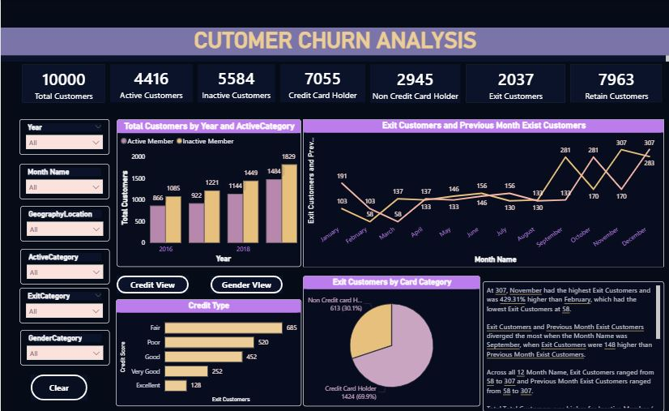
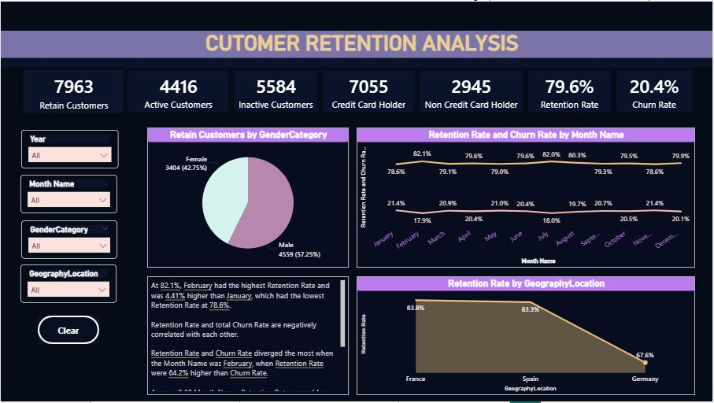

# 📊 Bank Churn Analysis

## 📌 Project Overview

Customer churn is a major challenge in the banking industry.
This project analyzes customer data using Power BI to identify patterns and key factors that influence customer churn.

---

## 🎯 Objective

* Identify customers at risk of leaving
* Understand key drivers behind churn
* Provide insights to improve customer retention

---

## 🛠 Tools & Technologies

* Power BI (Data Visualization)
* Excel (Data Cleaning & Preparation)

---

## ## 📊 Dashboard Preview

### 🔹 Churn Analysis

### 🔹 Retension Analysis

---

## 📈 Key Insights

* Customers with **low account balance** are more likely to churn
* Customers with **fewer products** show higher churn rate
* **Senior citizens** have a higher probability of churn
* Certain regions and customer segments show higher churn trends

---

## 📉 Business Impact

This analysis helps banks:

* Improve customer retention strategies
* Identify high-risk customers early
* Make data-driven decisions to reduce churn

---

## 📂 Project Files

* 📄 BANK_ANALYSIS.pdf – Full dashboard report
* 🖼 Dashboard images – Visual representation of insights

---

## 🚀 Future Improvements

* Add predictive modeling (Machine Learning)
* Integrate real-time data
* Enhance dashboard interactivity

---

## 👩‍💻 About Me

Hi, I’m **Deepika** — an aspiring Data Analyst skilled in Power BI, SQL, and Excel.
I am passionate about turning data into actionable insights.

📫 Email: [jadala.deepika893@gmail.com](mailto:jadala.deepika893@gmail.com)
